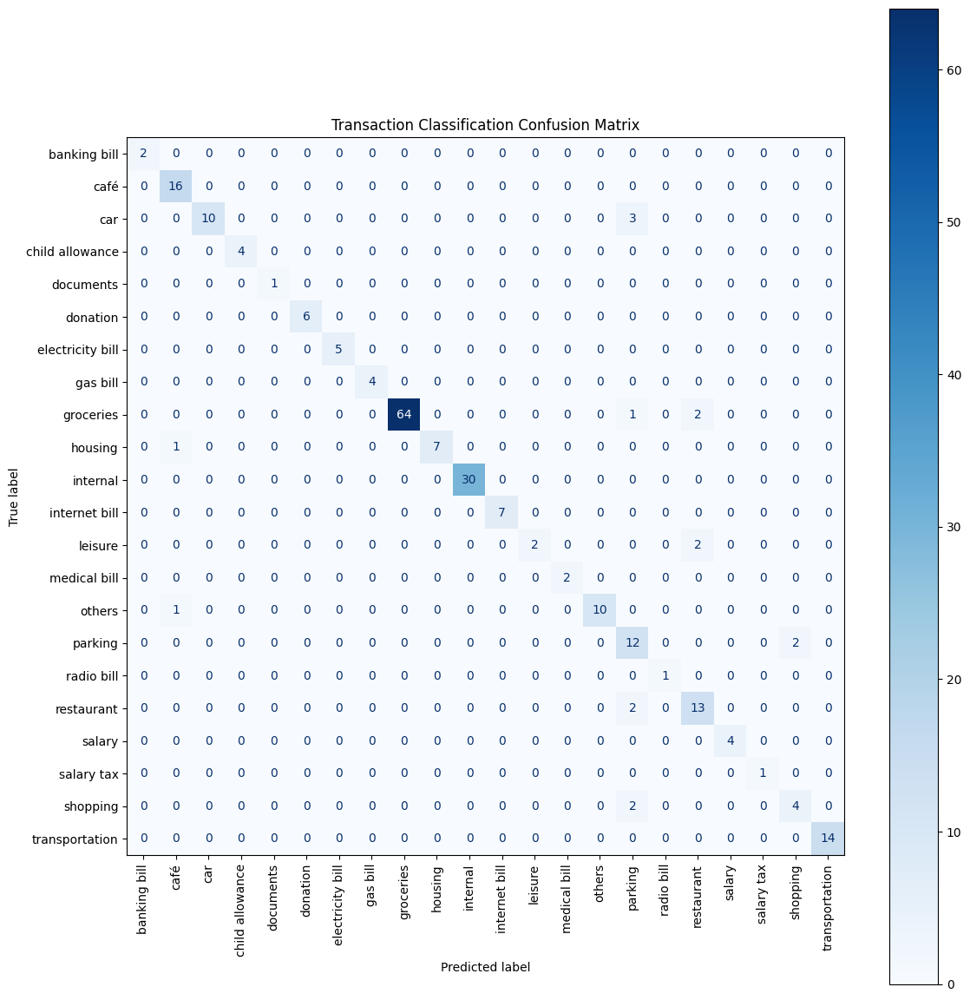

# H.A.R.U — Home Accounting & Resource Utility

A self-hosted personal finance assistant that ingests bank transaction 
exports, automatically categorizes them using a trained ML classifier, 
and lets users query their spending data in natural language via an 
LLM-powered chat interface and generate dahsboard.

---

## Features

- **Automatic transaction categorization**, TF-IDF + Logistic 
  Regression classifier trained on real German bank export data 
  (93.19% accuracy, 23 categories)
- **Natural language querying**, ask questions in plain English, 
  answered with real database results via an LLM-powered NL-SQL pipeline
- **CSV upload**, with German bank export formats 
  (semicolon-separated, comma decimals, DD.MM.YYYY dates)
- **Manual cash entry**, also add cash transactions with model-suggested 
  categories.
- **Spending dashboard**, 3 Grafana panels embedded in the app UI 
  (monthly trend, category breakdown, top merchants)
- **Transaction logs**, filterable income and expense history
- **Fully containerized**, Flask + MySQL + Grafana via Docker Compose

---

## Architecture
Bank CSV / Manual Entry
--> Cleaning & Normalization (Pandas)
--> ML Categorization (TF-IDF + Logistic Regression)
--> MySQL Database 
--> Flask REST API + Grafana Dashboard (NL → SQL → LLM answer & embedded panels) 
--> Web UI (HTML/CSS/JS)

---

## Tech Stack

| Layer | Technology |
|---|---|
| Language | Python 3.11 |
| ML | Scikit-learn (TF-IDF, Logistic Regression) |
| LLM | OpenAI API (gpt-4o-mini) |
| Backend | Flask, SQLAlchemy |
| Database | MySQL 8.0 |
| Dashboard | Grafana |
| Frontend | HTML, CSS, Vanilla JavaScript |
| Containerization | Docker, Docker Compose |
| Cloud | AWS EC2, AWS ECR |
| Dev Tools | Jupyter Notebook, VS Code, Git/GitHub |

---

## ML Model: Categorization

### Approach
Text features are built by concatenating the `counterparty` and 
`reference` fields from bank exports. This was a deliberate design 
decision: German bank exports often hide the real merchant name in 
the payment reference field (e.g. counterparty = "PayPal Europe 
S.a.r.l." but reference = "Lieferando").

Pipeline: `TfidfVectorizer(ngram_range=(1,2))` → 
`LogisticRegression(class_weight='balanced', max_iter=1000)`

`class_weight='balanced'` was added after identifying class imbalance 
in the training data — categories like `documents` (3 rows) and 
`sport` (2 rows) were being ignored by the model without it.

### Results
- **Overall accuracy: 93.19%** (235 test samples, 80/20 split, stratified)
- Strong performance: `groceries` (F1: 0.98), `transportation` (F1: 1.00), 
  `internal` (F1: 1.00)
- Known weak categories: `leisure` (F1: 0.67), `shopping` (F1: 0.67), 
  `parking` (F1: 0.71) — due to diverse merchant names and limited 
  training examples

### Limitations
- Model trained on one household's spending patterns and will not 
  generalize well to very different spending habits without retraining
- PayPal transactions remain challenging: the real merchant is buried 
  in the reference field and varies widely
- Rare categories (< 10 training examples) are handled by a manual 
  override in the UI

---

## LLM Query Layer

The LLM (gpt-4o-mini) is used in two steps but **never trusted with 
arithmetic**:

1. **NL to SQL**: converts the user's question into a constrained 
   MySQL SELECT query using few-shot prompting
2. **Result to Answer**: receives only the query result (numbers 
   already computed by MySQL) and phrases a natural language response

This design prevents hallucinated totals — a known failure mode when 
LLMs are asked to reason over raw numbers directly.

**Safety guardrails:**
- Generated SQL is validated against a forbidden keyword list 
  (`INSERT`, `UPDATE`, `DELETE`, `DROP`, etc.) before execution
- Only `SELECT` statements are allowed through
- `UNABLE_TO_ANSWER` returned for out-of-schema questions

---

## Project Structure
HARU/
├── app/
│   ├── init.py        # Flask app factory
│   ├── routes.py          # API endpoints
│   ├── models.py          # SQLAlchemy models
│   ├── llm.py             # OpenAI integration
│   ├── static/            # CSS, images
│   └── templates/         # HTML templates
├── data/
│   ├── confusion.png      # Model evaluation
│   └── haru_grafana.sql   # Grafana panel queries
├── config.py              # Environment config
├── run.py                 # App entry point
├── Dockerfile
├── docker-compose.yml     # Flask + MySQL + Grafana
└── requirements.txt

---

 Open the app:
- Chat: `http://localhost:5000/chat`
- Dashboard: `http://localhost:5000/dashboard`
- Grafana: `http://localhost:3000`

---

## API Endpoints

| Method | Endpoint | Description |
|---|---|---|
| GET | `/transactions` | List transactions (filterable by category, direction, place, source) |
| POST | `/ask` | Natural language query → SQL → answered response |
| POST | `/add` | Add manual transaction with ML category prediction |
| POST | `/upload-csv` | Bulk import bank CSV export |
| POST | `/predict-category` | Predict category for a given merchant description |
| GET | `/income` | Income log view |
| GET | `/expenses` | Expenses log view |
| GET | `/dashboard` | Dashboard view with embedded Grafana panels |

---

### Some limitations
- Model trained on single-household German spending data
- Grafana time filter works fully on Panel 1 (time series); 
  Panels 2 and 3 use a month variable filter
- `internal` category (transfers between accounts) inflates 
  total spending figures.
- November 2025 spending appears elevated due to ATM withdrawals 
  for a cash-heavy trip abroad.
- Flask runs in development mode, production deployment should 
  use Gunicorn or uWSGI

---

## Author

**Ricki Ahadian**

[LinkedIn] www.linkedin.com/in/ricki-ahadian-292469257 | 
[GitHub] https://github.com/ricki4343